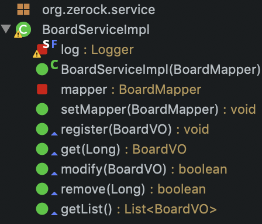

### 1. 비지니스 계층의 설정
- org.zerock.service
- 설계를 할 때 각 계층 간의 연결은 인터페이스를 이용해서 느슨한(loose) 연결(결합)을 함
- 게시물은 BoardService 인터페이스
- 이를 구현한 BoardServiceImpl 클래스를 선언함
- 메서드를 설계할때는 현실적인 로직의 이름을 붙이는 것이 관례
- 스프링 4.3 부터는 단일 파라미터를 받는 생성자의 경우, 필요한 파라미터를 자동으로 주입할 수 있음
---
### 2. BoardService.java (Interface)
```java
  public void register(BoardVO board);
  public BoardVO get(Long bno);
  public boolean modify(BoardVO board);
  public boolean remove(Long bno);
  public List<BoardVO> getList();
```
- 명백하게 반환해야 할 데이터가 있는 'select'를 해야하는 메서드는 리턴타입을 지정할 수 있음
  - 특정한 게시물을 가져오는 `get()`
  - 전체 리스트를 구하는 `getList()`
---
### 3. BoardServiceImpl.java
- Class -> interfaces -> add -> BoardService.java
- ==@Service==
  - 계층 구조상 주로 비지니스 영역을 담당하는 객체임을 표시하기 위해 사용
  - 패키지를 읽어 들이는 동안 처리가 됨
  - 정상적으로 작동하기 위해서는 BoardMapper 객체가 필요함
    - @Autowired와 같이 직접 설정해 줄 수 있고, Setter(Lombok)를 이용해서 처리할 수도 있다
- ==@AllArgsConstructor==    
  - 모든 파라미터를 이용하는 생성자를 만들기 때문에 BoardMapper를 `주입`받는 `생성자`가 만들어지게 됨
  - 4.3의 자동주입 기능으로 인해 그림과 같아짐
  
