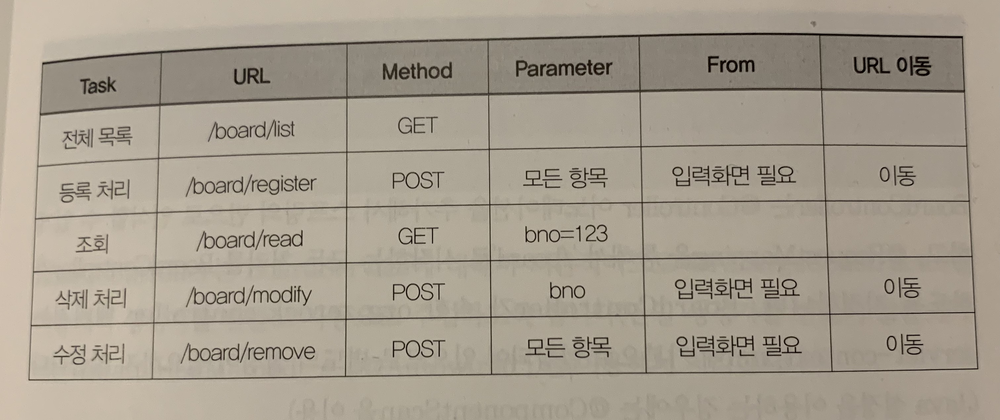

### 1. Controller의 작성
- 클래스 내에서 여러 메서드를 작성하고 @RequestMapping 등을 이용해서 URL을 분기하는 구조로 작성 할 수 있음
- 필요한 만큼 메서드의 분기를 이용하는 구조로 작성
- 과거에는 Tomcat(WAS)를 실행하고 웹 화면을 만들어서 결과를 확인하는 방식의 코드로 작성해왔음
- 이 방식은 시간도 오래걸리고 테스트를 자동화 하기에 어려움이 많음
- 따라서 WAS를 실행하지 않고 Controller를 테스트 할 수 있는 방법을 학습헤야함
---

### 2. BoardController의 분석
- 반드시 현재 원하는 기능을 호출하는 방식에 대해 다음과 같이 테이블로 정리한 후 코드를 작성하는 것이 좋음

- From 항목은 해당 URL을 호출하기 위해서 별도의 입력화면이 필요하다는 것을 의미

### 3. BoardController의 작성
- org.zerock.controller
- URL 분석된 내용들을 반영하는 메서드를 설계함
- @Controller 어노테이션으로 스프링의 빈으로 인식할 수 있게 함
- @RequestMapping을 통해서 '/board'로 시작하는 모든처리를 BoardController에서 가능하도록 지정
- org.zerock.controller는 servlet-context.xml에 기본으로 설정되어 있으므로 별도의 설정이 필요하지 않음 (java 설정 이용시 @ComponentScan을 이용)
```java
@Controller
@Log4j
@RequestMapping("/board/*")
public class BoardController {

}
```
