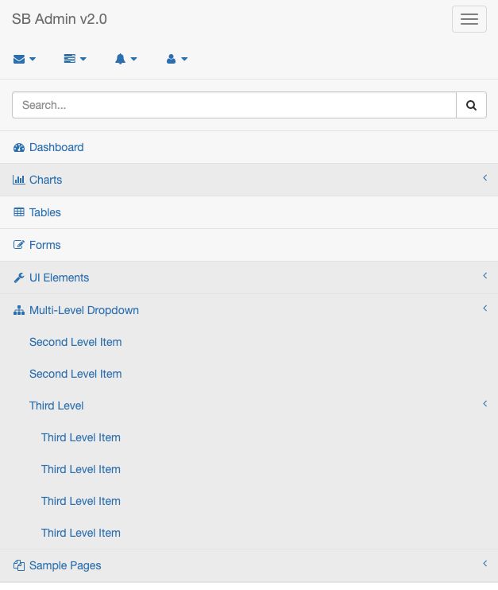

### [1. Servlet context](#1)
### [2. BootStrap 적용법](#2)
### [3. Header, Footer](#3)
### [4. jQuery 라이브러리 변경](#4)
### [5. 반응형 웹처리](#5)
---
#### 1
 - 스프링 MVC의 JSP를 처리하는 과정은 servlet-context.xml에 아래와 같이 작성되어 있음
 - 화면 설정은 ViewResolver라는 객체를 통해서 이루어짐
 - 설정을 보면 '/WEB-INF/views/' 폴더를 이용하는 것을 볼 수 있음
 - '/WEB-INF' 경로는 브라우저에서 직접 접근할 수 없는 경로이므로 반드시 Controller를 이용하는 모델2 방식에서는 기본적으로 사용하는 방식
  ```xml
  <!-- Handles HTTP GET requests for /resources/** by efficiently serving up static resources in the ${webappRoot}/resources directory -->
  <resources mapping="/resources/**" location="/resources/" />
  <!-- Resolves views selected for rendering by @Controllers to .jsp resources in the /WEB-INF/views directory -->
  <beans:bean class="org.springframework.web.servlet.view.InternalResourceViewResolver">
    <beans:property name="prefix" value="/WEB-INF/views/" />
    <beans:property name="suffix" value=".jsp" />
  </beans:bean>
  ```
  - 게시물 리스트의 URL은 '/board/list' 이므로 최종적인 `'/WEB-INF/views/board/list.jsp'` 가 됨
  - 해당 경로에 list.jsp 파일을 추가
  - localhost:8080/board/list 로 접근
  - 기본 경로는 '/'로 설정되어 있지 않고 /controller 경로를 갖고 있음
  - 톰켓 설정 또는 Web Settings 를 이용해서 '/'로 잡아줌
    - 경로에 대한 설정은 css, js, 이미지 파일등의 경로에 치명적인 영향을 주기 때문에 처음부터 절대경로 혹은 상대 경로에 대해서 명확히 결정한 후에 프로젝트를 진행할 것
    - 일반적인 경우라면 절대 경로를 이용하는 것이 좋음

#### 2
  - SB Admin2의 pages 폴더에 있는 tables.html의 내용을 list.jsp의 내용으로 그대로 복사해서 수정하고 실행
  - 수정할때는 상단에 JSP의 Page 지시자는 지우지 않아야함
    - `<%@ page language="java" contentType="text/html; charset=UTF-8"
    pageEncoding="UTF-8"%>`
  - 그대로 실행하면 브라우저에서 CSS 등이 완전히 깨진 상태이므로 텍스트만 출력되는 것을 볼 수 있음
    - CSS와 JS파일들의 경로를 수정하는 작업은 브라우저의 개발자 도구를 통해서 확인하며 진행함
    - 브라우저의 Network 부분을 확인하고 페이지를 '새로고침' 하면 잘못된 URL의 정보를 확인할 수 있음
  - css나 js 파일과 같이 정적인 (static) 자원들의 경로를 'resources'라는 경로로 지정하고 있음
  ```xml
  <!-- Handles HTTP GET requests for /resources/** by efficiently serving up static resources in the ${webappRoot}/resources directory -->
	<resources mapping="/resources/**" location="/resources/" />
  ```
  - SB Admin2의 압축을 풀어둔 모든 폴더를 프로잭트 내 webapp 밑의 resources 폴더로 복사해 넣음
    - resources 라는 폴더가 여러 개 존재하므로 주의해야 함
    - WEB-INF 라는 경로를 기준으로 찾는 것이 좋음
  - 파일들을 resources 경로에 넣어도 아직은 페이지에서 경로를 수정하지 않았기 때문에 문제가 생기는것은 동일
  - list.jsp 파일에서 CSS나 JS파일의 경로를 '/resources'로 시작하도록 수정함
  - 가장 간단한 방법은 Find/Replace를 이용하는 방법
---
### 3
  - JSP를 작성할 때마다 많은 양의 HTML 코드를 이용하는 것을 피하기 위해
  - JSP의 include 지시자를 활용해서 페이지 제작시에 필요한 내용만을 작성할 수 있게 사전에 작업을 해야 함
    - views -> includes -> header.jsp, footer.jsp
    - 브라우저에서 '검사' 기능을 활용하면 특정한 <div>가 어떤 부분을 의미하는지 확인할 수 있음


  - 1. header.jsp
    - 핵심 부분이 아닌 영역중에서 위쪽의 HTML 내용을 처리하기 위해서 작성함
    ```jsp
     <%@ include file="../includes/header.jsp" %>
    ```


 - 2. footer.jsp
    ```jsp
    <%@ include file="../includes/footer.jsp" %>
    ```

### 4
  - 예제에는 footer.jsp에 jQuery 라이브러리가 포함되어 있음
  - 성능을 조금 손해 보더라도 jQuery를 header.jsp에 선언해 두면 작성하는 JSP에서 자유로울 수 있으므로 수정함
    - footer.jsp 상단에 있는 jquery.min.js 파일의 `<script>` 태그를 제거
    - [GoogleDevlopers](http://developers.google.com/speed/libraries) 에서 jQuery 다운로드
  - 헤더의 마지막 부분에 추가
    ```jsp
    <script src="https://ajax.googleapis.com/ajax/libs/jquery/3.3.1/jquery.min.js"></script>
    ```
### 5
  
  - jQuery를 최신 버전을 사용하면 위와 같이 메뉴가 펼쳐지는 문제가 발생
  - includes 폴더 내 footer.jsp 에 코드추가
    ```javascript
    <script>
  	  $(document).ready(function() {
  		 $('#dataTables-example').DataTable({
  			responsive: true
  		 });
  		 $(".sidebar-nav")
  			.attr("class","sidebar-nav navbar-collapse collapse")
  			.attr("aria-expanded",'false')
  			.attr("style","height:1px");
  	  });
  	</script>
    ```
