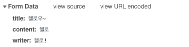

### [1. 목록](#1)
### [2. 등록, 입력](#2)
---
### 1
  - list.jsp 를 include 방식으로 처리했음에도 많은 html 내용이 존재함
  - 최소한의 태그들만 적용하겠음
  - list.jsp에는 JSTL의 출력과 포멧을 적용할 수 있는 태그 라이브러리를 추가하겠음
  ```html
  <%@ page language="java" contentType="text/html; charset=UTF-8"
      pageEncoding="UTF-8"%>
  <%@ include file="../includes/header.jsp" %>
  <%@ taglib prefix="c" uri="http://java.sun.com/jsp/jstl/core" %>
  <%@ taglib prefix="fmt" uri="http://java.sun.com/jsp/jstl/fmt" %>
              <div class="row">
                  <div class="col-lg-12">
                      <h1 class="page-header">Tables</h1>
                  </div>
                  <!-- /.col-lg-12 -->
              </div>
              <!-- /.row -->
              <div class="row">
                  <div class="col-lg-12">
                      <div class="panel panel-default">
                          <div class="panel-heading">
                              DataTables Advanced Tables
                          </div>
                          <!-- /.panel-heading -->
                          <div class="panel-body">
                              <table width="100%" class="table table-striped table-bordered table-hover" id="dataTables-example">
                                  <thead>
                                      <tr>
                                          <th>#번호</th>
                                          <th>제목</th>
                                          <th>작성자</th>
                                          <th>작성일</th>
                                          <th>수정일</th>
                                      </tr>
                                  </thead>

                                </table>
                          </div>
                          <!-- /.panel-body -->
                      </div>
                      <!-- /.panel -->
                  </div>
                  <!-- /.col-lg-6 -->
   			</div>
              <!-- /.row -->
        			<%@ include file="../includes/footer.jsp" %>
  ```

  - 추가후 브라우저에 이상 없는지 확인
- #### JSTL
  - board/list를 실행했을 때 이미 BoardController는 Model을 이용해서 게시물의 목록을 'list'라는 이름으로 담아서 전달함
  - list.jsp에서는 이를 출력해야함 출력은 `JSTL`을 이용
    ```html
      <c:forEach items="${list}" var="board">
       <tr>
         <td><c:out value="${board.bno}"/></td>
         <td><c:out value="${board.title}"/></td>
         <td><c:out value="${board.writer}"/></td>
         <td><fmt:formatDate pattern="yyyy-MM-dd" value="${board.regdate}"/></td>
         <td><fmt:formatDate pattern="yyyy-MM-dd" value="${board.updateDate}"/></td>
       </tr>
      </c:forEach>
    ```
---
### 2
  - 게시물 등록 작업은 POST 방식으로 하지만, 화면에서 입력을 받아야 하므로 GET 방식으로 입력페이지를 볼 수 있도록
  BoardController에 메서드를 추가
  - 기존에 @PostMapping("/register") 에 register() 메소드가 있지만 타입과 어노테이션이 다른 메서드 오버로딩
  ```java
    @GetMapping("/register")
    public void register() {

    }
  ```
  ##### 1. register.jsp
    - <form> 태그를 이용해서 필요한 데이터를 전송함
    - <input>, <textarea> 태그의 name 속성은 BoardVO 클래스의 변수와 일치시켜줌
    - /board/register 화면이 제대로 출력되는지 확인
  ```html
  <div class="row">
  <div class="col-lg-12">
    <div class="panel panel-default">

      <div class="panel-heading">Board Register</div>
      <!-- /.panel-heading -->
      <div class="panel-body">

        <form role="form" action="/board/register" method="post">
          <div class="form-group">
            <label>Title</label> <input class="form-control" name='title'>
          </div>

          <div class="form-group">
            <label>Text area</label>
            <textarea class="form-control" rows="3" name='content'></textarea>
          </div>

          <div class="form-group">
            <label>Writer</label> <input class="form-control" name='writer'>
          </div>
          <button type="submit" class="btn btn-default">Submit
            Button</button>
          <button type="reset" class="btn btn-default">Reset Button</button>
        </form>

      </div>
      <!--  end panel-body -->

    </div>
    <!--  end panel-body -->
  </div>


  <!-- end panel -->
  </div>
  ```
  - 입력은 되나 한글이 깨지는 문제 발생
  - 브라우저 -> f12 -> network -> register
      - post 방식을 제대로 전송되었는지, 한글이 깨진상태로 전송된것인지를 확인
      - 문제가 없다면 스프링 MVC 쪽에서 한글을 처리하는 필터를 등록해야함
        
      - 브라우저에서는 문제없이 보냈음을 알 수 있는데 문제는 controller 혹은 데이터베이스 쪽이라는 것을 알 수 있음
      - BoardContoller와 BoardControllerImpl을 개발할 때는 이미 Lombok의 로그를 이용해서 필요한 기능등을 기롷개 두었으므로, 이를 확인해야함
        ```
        INFO : org.zerock.controller.BoardController - register: BoardVO(bno=null,  title=헬로우~, content=헬로, writer=핼로!, regdate=null, updateDate=null)
        ```
  - 해결방법 (web.xml) 필터추가
    ```xml
    <filter>
      <filter-name>encoding</filter-name>
      <filter-class>org.springframework.web.filter.CharacterEncodingFilter</filter-class>
      <init-param>
        <param-name>encoding</param-name>
        <param-value>UTF-8</param-value>
      </init-param>
    </filter>

    <filter-mapping>
      <filter-name>encoding</filter-name>
      <servlet-name>appServlet</servlet-name>
    </filter-mapping>
    ```
---
