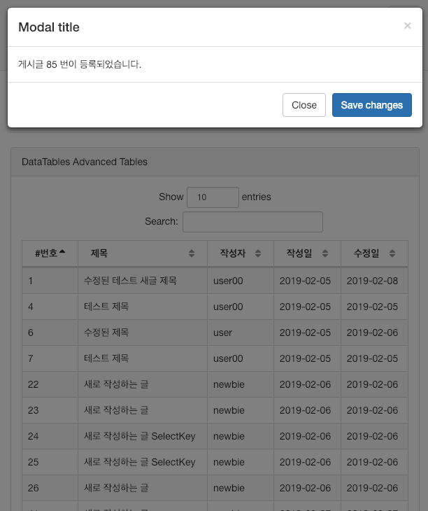

###[1. Redirect](#1)
###[2. Basic](#2)
###[3. 모달창 보여주기](#3)
---
### 1
  - #### 1. 재전송 (redirect) 처리
  ```
    Browser                   BoardController
        |                           |
        | ----------전달-----------> |

          <---/board/list로 Redirect

          ----/board/list 호출---->

          <----list.jsp-----------
  ```
    - 만일 Redirect를 하지 않는다면 사용자느 브라우저의 '새로고침'을 통해서 동일한 내용을 계속 서버에 등록할 수 있기 때문에 (흔히 도배라고 표현하는) 문제가 발생하게 됨
    - 브라우저에서는 이런 경우 경고창을 보여주기는 하지만 근본적으로 차단하지는 않음

    - 따라서 등록, 수정, 삭제 작업은 처리가 완료된후 다시 동일한 내용을 전송할 수 없도록 브라우저의 URL을 이동하는 방식을 사용함
    - 이러한 과정에서 하나 더 신경 써야하는 것은 브라우저에 등록, 수정, 삭제의 결과를 바로 알 수 있게 피드백을 줘야 한다는 점
    - 경고창이나 `<div>`를 이용하는 모달창을 이용해서 이러한 작업을 처리함
    - #### 2. RedirectAttributes
  - BoardController에서 모든 redirect 처리시 RedirectAttributes라는 특별한 타입의 객체를 이용함
    - addFlashAttribute()를 사용하기 위해
    - 일회성으로만 데이터를 전달하기 때문에 단 한 번만 사용할 수 있음
    - 내부적으로는 HttpSession을 이용해서 처리함
  - list.jsp에 추가
      ```html
      <script type="text/javascript">
   			$(document).ready(function(){
   				var result = '<c:out value="${result}"/>';
   			});
   		</script>
      ```
    - 개발자 도구 확인시 이와 같은 결과가 뜸
      ```html
      <script type="text/javascript">
        $(document).ready(function(){
          var result = '72';
        });
       </script>
      ```
    - refresh시에는
      ```html
        <script type="text/javascript">
          $(document).ready(function(){
            var result = '';
          });
        </script>
      ```
    - 이와 같이 일회성 데이터라는 것을 알 수 있음
    - 이를 이용해서 경고창이나 (alert()) 모달창 등을 보여줄것
---    
### 2
  - 최근에는 브라우저에서 경고창(alert)을 띄우는 방식보다 모달(Modal)을 보여주는 방식을 많이 사용함
  - BootStrap은 모달창을 간단하게 사용할 수 있으므로 목록 화면에서 필요한 메시지를 보여주는 방법을 사용해 봄
---
### 3
  - 모달창은 기본적으로 `<div>`를 화면 특정위치에 보여주고 배경이 되는 `<div>`에 배경색을 입혀서 처리함
  - 모달창은 활성화된 `<div>`를 선택하지 않고는 다시 원래의 화면을 볼 수 없도록 막기 때문에 메시지를 보여주는데 효과적인 방식
  - 모달창에 대한 코드는 다운로드한 SBAdmin2의 pages 폴더 내 notification.html 파일을 참고하면 됨

  - 모달창 처리를 위해서 우선 `<div>`를 이요해서 페이지의 코드에 추가해야함
  - list.jsp 내에 `<table>`태그의 하단에 모달창의 `<div>`를 추가함
    ```html
    <!-- Modal  추가 -->
    <div class="modal fade" id="myModal" tabindex="-1" role="dialog"
      aria-labelledby="myModalLabel" aria-hidden="true">
      <div class="modal-dialog">
        <div class="modal-content">
          <div class="modal-header">
            <button type="button" class="close" data-dismiss="modal"
              aria-hidden="true">&times;</button>
            <h4 class="modal-title" id="myModalLabel">Modal title</h4>
          </div>
          <div class="modal-body">처리가 완료되었습니다.</div>
          <div class="modal-footer">
            <button type="button" class="btn btn-default"
              data-dismiss="modal">Close</button>
            <button type="button" class="btn btn-primary">Save
              changes</button>
          </div>
        </div>
        <!-- /.modal-content -->
      </div>
      <!-- /.modal-dialog -->
    </div>
    <!-- /.modal -->
    ```
  - 모델창을 보여주는 작업은 jQuery를 이용해서 처리함
  - checkModal() 함수는 파라미터에 따라서 모달창을 보여주거나 내용을 수정한 뒤 보이도록 작성함
  - 새로운 개시글이 작성되는 경우 RedirectAttributes로 게시물의 번호가 전송되므로 이를 이용해서 모달창의 내용수정
  - `$("#modal").modal('show')`를 호출하면 모달이 보이게 됨
    ```js
    $(document).ready(function(){

  		var result = '<c:out value="${result}"/>';

  		checkModal(result);

    	function checkModal(result) {

    		if (result === '') {
    			return;
    		}

    		if (parseInt(result) > 0) {
    			$(".modal-body").html(
    					"게시글 " + parseInt(result)
    							+ " 번이 등록되었습니다.");
    		}

    		$("#myModal").modal("show");
    	}
  	});
    ```
    
---
