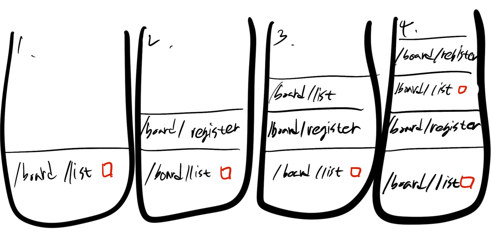
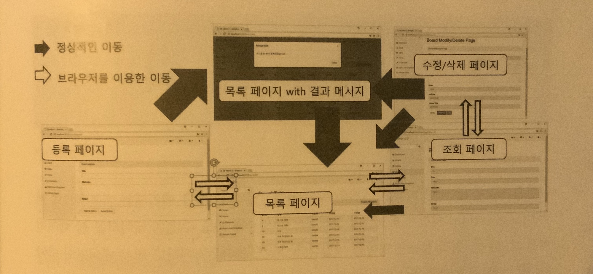

- # View
  - ## [1. 목록페이지에서 등록페이지](#1)
  - ## [2. 목록페이지에서 조회페이지](#2)
  - ## [3. 목록페이지와 뒤로가기](#3)
  - ## [4. 게시물의 수정/삭제 처리](#4)

---
### 1
  - list.jsp
    ```html
      <div class="panel-heading">Board List Page
        <button id="regBtn" type="button" class="btn btn-xs pull-right">Register New Board</button>
      </div>
    ```
  - jQuery
    ```js
    $("#regBtn").on("click", function() {
      self.location = "/board/register";
    });
    ```
---
### 2
  - 목록 페이지에서 링크를 통해 GET 방식으로 특정한 번호의 게시물을 조회할 수 있는 기능을 작성
  - BoardController에 작성되어 있는 get 메소드
    ```java
    @GetMapping("/get")
    public void get(@RequestParam("bno") Long bno, Model model) {
      log.info("/get");
      model.addAttribute("board", service.get(bno));
    }
    ```
  - get.jsp
    - 게시물 번호를 보여줄 수 있는 필드를 추가하고, 모든 데이터는 readOnly를 지정해서 작성함
      ```html
      <div class="form-group">
        <label>Bno</label>
        <input class="form-control" name='bno' value='<c:out value="${board.bno}"/>' readonly="readonly">
      </div>
      ```
  - register.jsp
    - `<form>` 태그는 조회페이지에서는 그다지 필요하지 않으므로 제거하는 대신 마지막에는 수정, 삭제 페이지로 이동하거나 원래의 목록페이지로 이동할 수 있는 버튼을 추가함
    ```html
      <button data-oper='modify' class="btn btn-default">
        <a href="/board/modify?bno=<c:out value="${board.bno}"/>">
          Modify0
        </a>
      </button>

      <button data-oper='list' class="btn btn-info">
        <a href="/board/list">
          List
        </a>
      </button>
    ```
---
### 3
  - 목록페이지에서 각 게시물의 title에 `<a>` 태그를 적용해서 조회 페이지로 이동하게 처리할것
  - 최근 웹페이지들은 사용자의 트래픽을 고려해 목록 페이지에서 새창을 띄워서 조회 페이지로 이동하는 방식을 선호함
  - 전통적인 방식에서는 현재창 내에서 이동하는 방식을 사용함
  - 의외로 이러한 처리가 제대로 되지 않는 경우를 많이 보게됨
  - 예를들어 '뒤로가기'를 하면 다시 다운로드를 시도하거나 경고창이 뜨는 경험들을 할 수 있음
- **목록에서 조회 페이지로의 이동**
     - list.jsp
    ```html
      <td>
        <a href='/board/get?bno=<c:out value="${board.bno}"/>'>
          <c:out value="${board.title}"/>
        </a>
      </td>
    ```
    - 제목에 링크가 걸리는 것을 확인할 수 있고 클릭시 조회 페이지로 이동하는 것을 볼 수 있음
    - 조회 페이지로의 이동은 JavaScript를 이용해서 처리할 수도 있고, 위와 같이 직접 `<a>`태그를 이용해서도 처리 가능
    - 만일 조회 페이지를 이동하는 방식이 아니라 '새창'을 통해서 보고싶다면 `<a>`태그의 속성으로 `target='_blank'` 를 지정하면 됨
    - `<a>`태그와 `<form>`태그에는 target을 지정할 수 있는데 `_blank`는 새로운 창에서 처리됨
    - 예제는 target 속성을 지정하지 않고 사용하는 전통적인 방식을 이용
- **뒤로 가기의 문제**
  - 동일한 페이지 내에서 목록페이지와 조회페이지의 이동은 정상적으로 처리된 것 같아 보이지만 문제가 있음
  - 테스트 결과 `등록 -> 목록 -> 조회 -> 뒤로가기`를 하면 모달창이 계속 뜸
  - 문제의 원인은 뒤로가기나 앞으로 가기를 하면 서버를 다시 호출하는게 아니라 과거에 자신이 가진 모든 데이터를 활용하기 때문
  - addFlashAttribute의 result는 '' 값으로 되어있지만 모달창에서는 해당 개시물의 번호가 보임
  - 여러번 조회 페이지와 목록 페이지를 앞으로, 뒤로 이동해도 서버에서는 처음에 호출을 제외하고 별다른 변화가 없는 것을 확인할 수 있음 (콘솔에서 뒤로가기, 앞으로가기를 누를때의 해당 페이지의 로그들은 뜨지 않음)
  - 이 문제의 해결 방법은 window의 history 객체를 이용해서 현재 페이지는 모달창을 띄울 필요가 없다고 표시를 해 두는 방식을 이용해야 함
  - window의 history 객체는 ==스택== 구조로 동작
  
  - 1 번은 사용자가 브라우저를 열고 '/board/list'를 최초로 호출한 것
    - history에 쌓으면서 현재 페이지는 모달창을 보여줄 필요가 없다는 표시 (빨간박스)를 해둠
  - 2 번은 사용자가 '/board/register'를 호출한 경우
    - 스택의 상단에 '/board/register'가 쌓이게 됨
    - 만일 이상태로 뒤로가기를 실행하면 아래쪽의 '/board/list'가 보이는데 이때 심어둔 표시를 이용해서 모달창을 띄울 필요가 없다는 것을 확인할 수 있음
  - 3 번은 사용자가 등록을 완료하고 '/board/list'가 호출되는 상황
    - 브라우저에서 앞으로 가기나 뒤로가기로 이동한 것이 아니므로 스택의 상단에 추가됨
    - 등록직후에 '/board/list'로 이동한 경우에는 모달창이 동작함
    - 모달창을 보여준 후에는 스택의 상단에 모달창이 필요하지 않다는 표시를 해주어야함
    - 이후에 '/board/register'를 호출하면 4번과 같게 됨
  - window.histroy 객체를 조작하는 것은 이론적으로 복잡해 보이지만 사실 코드는 약간의 변화만을 필요로함
  ```javascript
  $(document).ready(function(){   				
   				var result = '<c:out value="${result}"/>';
   				checkModal(result);
   				history.replaceState({}, null, null);

  				function checkModal(result) {
  					if (result === '' || history.state) {
  						return;
  					}
  					if (parseInt(result) > 0) {
  						$(".modal-body").html(
  								"게시글 " + parseInt(result)
  										+ " 번이 등록되었습니다.");
  					}
  					$("#myModal").modal("show");
  				}			
  				$("#regBtn").on("click", function() {
  					self.location = "/board/register";
  				});
   			});
  ```
  - 기존과 달라진 점은 history.replaceState()부분과 checkModal()에서 histroy.state를 체크하는 부분
    - [history.replaceState()](https://developer.mozilla.org/ko/docs/Web/API/History_API)
  - JavaScript의 처리는 우선 checkModal()을 실행하는데 만일 등록후에 이동한 것이라면 3번처럼 되기 때문에 모달창이 보임
  - 모달창이 보이는 여부와 관계없이 JavaScript의 모든 처리가 끝나게 되면 history에 쌓이는 상태는 모달창을 보여줄 필요가 없는 상태가 됨
---
### 4
  - 게시물의 수정 작업의 종류
    - 조회페이지에서 직접 처리하는 방식
    - 별도의 수정/삭제 페이지를 만들어서 해당 페이지에서 수정과 삭제를 처리하는 방식
    - *최근에는 게시물의 조회 페이지에서 댓글 등에 대한 처리가 많아지면서 수정과 삭제는 별개의 페이지에서 하는것이 일반적*
    - 조회 페이지에서는 GET 방식으로 처리되는 URL을 통해서 수정/삭제 버튼이 존재하는 화면을 볼 수 있게 제작해야함
    - 수정 혹은 삭제 작업은 POST 방식으로 처리되고, 결과는 다시 목록 화면에서 확인할 수 있는 형태로 제작
  - #### 수정/삭제 페이지로 이동
    - 조회 페이지와 같음, 따라서 기존의 get() 메서드를 조금 수정해서 화면을 구성함
    - @GetMapping 이나 @PostMapping 등에는 URL을 배열로 처리할 수 있음

    - `boardController.java`
    ```java
    @GetMapping({"/get", "/modify"})
    public void get(@RequestParam("bno") Long bno, Model model) {
      log.info("/get or modify");
      model.addAttribute("board", service.get(bno));
    }
    ```
    - 브라우저에서는 '/board/modify?bno=1'과 같은 방식으로 처리하므로 views 폴더 내 modify.jsp를 작성
    - modify.jsp는 get.jsp와 같지만 수정이 가능한 '제목'이나 '내용'등의 readonly 속성이 없도로 작성함
    - POST 방식으로 처리하는 부분을 위해서는 <form> 태그로 내용들을 감쌈
    - `<form>`태그는 action 속성을 '/board/modify'로 지정했지만 삭제를 하면 '/board/remove'와 같이 action 속성의 내용을 수정해서 사용하게 됨
    - 등록일과 수정일은 나중에 BoardVO로 수집되어야 하므로 날짜 포멧을'yyyy/mm/dd'의 포멧으로 해야함
      - 만일 포멧이 맞지 않으면 파라미터 수집 부분에 문제가 생기므로 주의가 필요함
    - 마지막에는 '수정/삭제/목록'등의 버튼을 추가
    - `modify.jsp`
    ```html
      <form role="form" action="/board/modify" method="post">
        <div class="form-group">
          <label>Bno</label>
          <input class="form-control" name='bno'
             value='<c:out value="${board.bno }"/>' readonly="readonly">
        </div>
        <div class="form-group">
          <label>Title</label>
          <input class="form-control" name='title'
            value='<c:out value="${board.title }"/>' >
        </div>
        <div class="form-group">
          <label>Text area</label>
          <textarea class="form-control" rows="3" name='content' ><c:out value="${board.content}"/></textarea>
        </div>
        <div class="form-group">
          <label>Writer</label>
          <input class="form-control" name='writer'
            value='<c:out value="${board.writer}"/>' readonly="readonly">            
        </div>
        <div class="form-group">
          <label>RegDate</label>
          <input class="form-control" name='regDate'
            value='<fmt:formatDate pattern = "yyyy/MM/dd" value = "${board.regdate}" />'  readonly="readonly">            
        </div>
        <div class="form-group">
          <label>Update Date</label>
          <input class="form-control" name='updateDate'
            value='<fmt:formatDate pattern = "yyyy/MM/dd" value = "${board.updateDate}" />'  readonly="readonly">            
        </div>

        <button type="submit" data-oper='modify' class="btn btn-default">Modify</button>
        <button type="submit" data-oper='remove' class="btn btn-danger">Remove</button>
        <button type="submit" data-oper='list' class="btn btn-info">List</button>
      </form>
      ```

      - `<button>` 태그에 'data-oper' 속성을 이용해서 원하는 기능을 동작하도록 처리
        - [data-](https://developer.mozilla.org/ko/docs/Web/HTML/Global_attributes/data-*)
        - `data-'Global-attribute'='value'`
        - `var data = $(this).data("Global-attribute");`
        - `data === 'value'`
      - `<form>` 태그의 모든 버튼은 기본적으로 submit으로 처리하기 때문에 `e.preventDefault`로 기본동작을 막고 마지막에 직접 submit()을 수행함
        <details>
        <summary>JavaScript</summary>
        <div markdown="1">

        ```javascript
        <script type="text/javascript">
        $(document).ready(function() {


            var formObj = $("form");

            $('button').on("click", function(e){

              e.preventDefault();

              var operation = $(this).data("oper");

              console.log(operation);

              if(operation === 'remove'){
                formObj.attr("action", "/board/remove");

              }else if(operation === 'list'){
                //move to list
                formObj.attr("action", "/board/list").attr("method","get");

                var pageNumTag = $("input[name='pageNum']").clone();
                var amountTag = $("input[name='amount']").clone();
                var keywordTag = $("input[name='keyword']").clone();
                var typeTag = $("input[name='type']").clone();      

                formObj.empty();

                formObj.append(pageNumTag);
                formObj.append(amountTag);
                formObj.append(keywordTag);
                formObj.append(typeTag);	       
              }

              formObj.submit();
            });

        });
        </script>
        ```
    </div>
    </details>

  - #### 수정/삭제 확인
    - 화면에서 게시물을 수정한 후 'modify' 버튼을 통해서 BoardController에 수정을 요청
    - Modify 버튼을 클릭하면 BoardController에서는 주어진 파라미터들을 BoardVo로 처리하게 되고 다음과 같이 수정된 값이 제대로 수집된것을 확인할 수 있음
    ```
    INFO : org.zerock.controller.BoardController - /get
    INFO : org.zerock.controller.BoardController - modify: BoardVO(bno=4, title=테스트 제목 수정됐나유?, content=테스트 내용 테스트아ㅡ아아, writer=user00, regdate=null, updateDate=Sun Feb 10 00:00:00 KST 2019)
    INFO : org.zerock.controller.BoardController - list
    ```    
    - 수정후에는 다시 'board/list'로 이동하게 됨
    - 이 경우에 대한 처리는 이미 완료되었으므로 모달창을 통해서 메시지 확인 가능
    - 화면에서 'Remove' 버튼을 클릭하게 되면 `<form>` 태그의 action의 값이 '/board/remove'가 되고 데이터들이 전송됨
    - 물론 BoardController에서는 bno 값 하나만 필요하지만 처리에는 문제가 없음
    ```
    INFO : org.zerock.controller.BoardController - /get or modify
    INFO : org.zerock.controller.BoardController - remove bno: 6
    INFO : org.zerock.controller.BoardController - list
    ```
  - #### 조회 페이지에서의 `<form>` 처리
    - 조회 페이지에서는 수정과 삭제가 필요한 페이지로 링크를 처리해야함
    - 직접 버튼에 링크를 처리하는 방식을 사용하여 처리하였지만, 나중에 다양한 상황을 처리하기 위해 `<form>` 태그를 이용해서 수정
    - `get.jsp`
    ```html
    <button data-oper='modify' class="btn btn-default">
      Modify
    </button>
    <button data-oper='list' class="btn btn-info">
      List
    </button>
    <form id='operForm' action="/board/bodify" method="get">
      <input type='hidden' id='bno' name='bno' value='<c:out value="${board.bno}"/>'>
    </form>
    ```
    - 사용자가 수정 버튼을 누르는 경우에는 bno 값을 같이 전달하고 `<form>` 태그를 submit 시켜서 처리함
    - 만일 사용자가 list로 이동하는 경우에는 아직 아무런 데이터도 필요하지 않으므로 `<form>`태그 내의 bno 태그를 지우고 submit을 통해서 리스트 페이지로 이동
    ```javaScript
    <script type="text/javascript">
    $(document).ready(function() {

      var operForm = $("#operForm");

      $("button[data-oper='modify']").on("click", function(e){

        operForm.attr("action", "/board/modify").submit();

      });


      $("button[data-oper='list']").on("click", function(e){

        operForm.find("#bno").remove();
        operForm.attr("action", "/board/list")
        operForm.submit();

      });  
    });
    </script>
    ```
  - #### 수정 페이지에서 링크 처리
    - 수정 페이지에서는 사용자가 다시 목록 페이지로 이동할 수 있도록 하기 위해서 JavaScript의 내용을 수정
    - 수정된 내용은 클릭한 버튼이 list인 경우 action 속성과 method 속성을 변경
    - '/board/list'로의 이동은 아무런 파라미터가 없기 때문에 `<form>` 태그의 모든 내용은 삭제한 상태에서 submit()을 진행함
    - 이후에 코드는 실행되지 않도록 return을 통해서 제어
    ```javaScript
    <script type="text/javascript">
    $(document).ready(function() {
  	  var formObj = $("form");
  	  $('button').on("click", function(e){
  	    e.preventDefault();
  	    var operation = $(this).data("oper");
  	    console.log(operation);
  	    if(operation === 'remove'){
  	      formObj.attr("action", "/board/remove");
  	    }else if(operation === 'list'){
  	      //move to list
  	      formObj.attr("action", "/board/list").attr("method","get");
  	      formObj.empty();  
  	    }
  	    formObj.submit();
  	  });
    });
    </script>
    ```
    
---    
