- ## [1. 오라클 데이터 베이스 페이징 처리](#1)
- ## [2. MyBatis와 스프링에서 페이징 처리](#2)

### 1
  - 구현된 기능들 중 가장 미숙한 부분은 목록 페이지
    - 성능에 영향을 미침
  - 구현 종류
    - 번호를 이용
      - 과거 웹 초기부터 이어오던 방식
    - 계속 보기의 형태
      - Ajax와 앱이 등장한 이후 '무한 스크롤'이나 '더 보기'와 같은 형태
  - 오라클에서 페이징 처리는 MySQL에 비해 추가적인 지식이 필요함
### 1.1
    - 데이터 베이스는 경우에 따라서 수백만 혹은 천만개 이상의 데이터를 처리하기 때문에 이 경우 정렬을 하게 되면 엄청나게 많은 시간과 리소스를 소모하게 됨
    - DB를 이용할 때 웹이나 어플리케이션에 가장 신경 쓰는 부분
      - 빠르게 처리 되는 것
      - 필요한 양만큼만 데이터를 가져오는 것
    - 거의 모든 웹페이지에서 페이징을 하는 이유는 최소한의 필요한 데이터만을 가져와서 빠르게 화면에 보여주기 위함
    - 만일 수백 만개의 데이터를 매번 정렬 해야하는 상황
      - 사용자는 정렬된 결과를 볼 때까지 오랜 시간을 기다려야 함
      - 특히 웹에서 동시에 여러 명의 사용자가 정렬이 필요한 데이터를 요청한다면 시스템에는 많은 부하가 걸리고 연결 가능한 커넥션의 개수가 점점 줄어
      - 서비스가 멈추게 됨
    - **빠르게 동작하는 SQL을 위해서는 먼저 order by를 이용하는 작업을 가능하면 하지 말아야 함**
      - 데이터가 많은 경우에 엄청난 성능의 저하를 가져옴
        - 데이터가 적은경우
        - 정렬을 빠르게 할 수 있는 방법이 있는 경우
        - 위에 두경우가 아니라면 order by는 주의 해야함
    - ##### 실행 계획과 order by
      - 오라클의 페이징 처리를 제대로 이해하기 위해 반드시 알아두어야 할 ==실행 계획 (execution plan)==
      - **'SQL 을 DB에서 어떻게 처리 할 것인가?'**
        - SQL이 데이터 베이스에 전달 되면 데이터 베이스는 여러 단계를 거쳐서 해당 SQL을 어떤 순서와 방식으로 처리할 것인지 계획을 세우게 됨
        - SQL의 처리 과정
        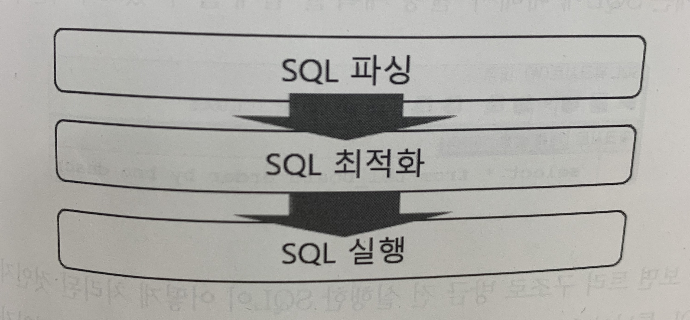
        - SQL 파싱 단계에서는 SQL 구문에 오류가 있는지 실행 대상 객체 (테이블, 제약조건, 권한 등)가 존재하는지를 검사함
        - SQL 최적화 단계에서는 SQL이 실행 되는데필요한 비용(cost)를 계산하게 됨
          - 이 계산된 값을 기초로 어떤 방식으로 실행하는 것이 가장 좋다는 것을 판단하는 '실행계획(excusion plan)'을 세움
        - SQL 실행 단계에서는 세워진 실행 계획을 통해 메모리상에서 데이터를 읽거나 물리적인 공간에서 데이터를 로딩하는 등의 작업을 하게됨
          - 개발자들은 도구를 이용하거나 SQL PLUS 등을 이용해 특정한 SQL에 대한 실행 계획을 알아볼 수 있음
          - SQL Developer에서는 간단히 버튼을 클릭해 실행 계획을 확인할 수 있음
            - 상단 계획 설명 버튼
            - 트리 구조로 실행한 SQL이 어떻게 처리된 것인지를 알려줌
            - 흔히 SQL 튜닝이라고 하는 작업은 이를 보고 어떤 방식이 더 효과적인지를 판단해서 수정함
            - '안쪽에서 바깥쪽으로, 위에서 아래로' 해석
- # 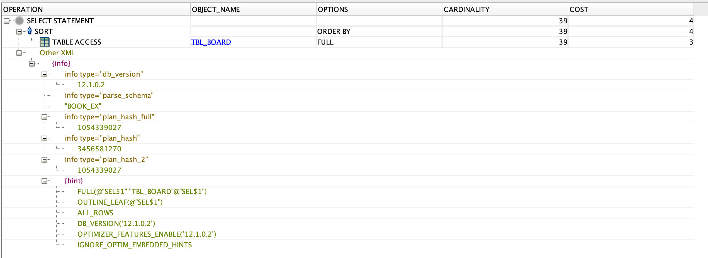
  - TBL-BOARD 테이블을 FULL로 접근하고 정렬 했다는 의미
    - FULL은 테이블 내의 모든 데이터를 스캔했다는 의미
  - 테스트를 위해 데이터가 많아지도록 SQL을 여러 번 실행
    ```
    -- 재귀 복사를 통해서 데이터 개수를 늘림
    insert into tbl_board (bno, title, content, writer) (select   seq_board.nextval, title, content, writer from tbl_board);
    commit
    select count(*) from tbl_board;
    -- 5,111,808
    ```
    [재귀복사 링크](https://hyeonstorage.tistory.com/m/294)

    SELECT 문으로 다수의 데이터 INSERT 하기
    ~~~
    INSERT INTO 테이블명 (COLUMN_LIST)
    SELECT COLUMN_LIST FROM 조회 테이블명 WHERE 조회 조건

    INSERT INTO PLAYER (PLAYER_ID, PLAYER_NAME, TEAM_ID, POSITION, HEIGHT, WEIGHT, BACK_NO)
    SELECT PLAYER_ID, PLAYER_NAME, TEAM_ID, POSITION, HEIGHT, WEIGHT, BACK_NO
    FROM PLAYER_BACKUP
    WHERE PLAYER_NAME = '박지성';

    INSERT INTO 테이블명
    SELECT * FROM 조회 테이블명 WHERE 조회 조건

    INSERT INTO PLAYER
    SELECT *
    FROM PLAYER_BACKUP
    WHERE PLAYER_NAME = '박지성';
    ~~~

- # 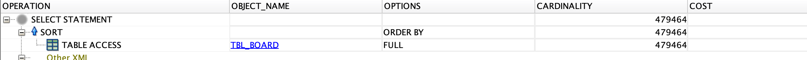
  - 이후 `select * from tbl_board order by bno desc;` 실행 결과가 0.005초 ..
  - `select * from tbl_board order by bno + 1 desc;` 실행 결과 11초 ..
    - 고의적으로 bno + 1 추가한 값을 역순으로 정렬
    - 실행 시간은 시스템의 상황이나 데이터베이스의 상황에 따라 차이가 남
    - 반복적으로 몇 번 실행하면 데이터베이스가 메모리상에 보관하는 데이터를 가져오는 상황이 되고 대략 1초대에 결과가 나올 수도 있음
      - 가장 많은 시간을 소모하는 작업은 정렬하는 작업
- # 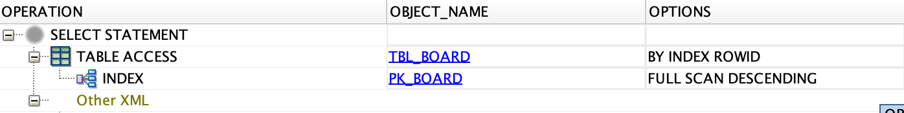      
  - 기존의 SQL이 TBL_BOARD 테이블 전체를 스캔했지만 이번에는 PK_BOARD라는 것을 이용해서 접근하고 기존과 달리 맨 위의 SORT 과정이 없음
  - 이것을 이해하려면 DB의 인덱스에 대해서 알아둬야함
- #### order by 보다는 인덱스
  - 데이터가 많은 승태에서 정렬 작업이 문제가 된다는 사실을 알았다면, 이 문제의 해결방안도 알아야함
  - 가장 일반적인 해결책은 인덱스를 이용해서 정렬을 생략하는 방법
  - 결론부터 말하자면 인덱스라는 존재는 이미 정렬된 구조이기 때문에 이를 이용해서 별도의 정렬을 하지 않는 방법
  ~~~sql
    select
    /*+ INDEX_DESC(tbl_board pk_board) */
    *
    from tbl_board where bno > 0;
  ~~~
  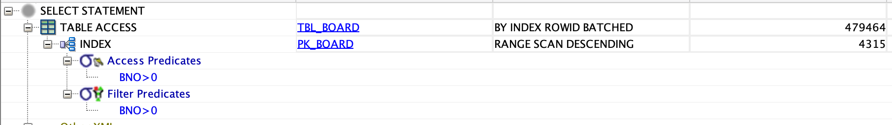
    - 테이블 전체를 조사하고 정렬한 것과 결과는 동일하지만 실행 시간은 엄청나게 차이가 나게 됨
    - 가장 중요한 점은 SQL의 실행시간이 0.1초 이하 로 나온다는 점
      - SORT를 하지 않았다는점
      - TBL_BOARD를 바로 접근하는 것이 아니라 PK_BOARD를 이용해서 접근한 점
      - RANGE SCAN DESCENDING, BY INDEX ROWID로 접근했다는 점
    - ##### PK_BOARD 라는 인덱스
      ~~~sql
        create sequence seq_board;

          create table tbl_board(
            bno number(10,0),
            title varchar2(200) not null,
            content varchar2(2000) not null,
            writer varchar2(50) not null,
            regdate date default sysdate,
            updatedate date default sysdate
          );

        alter table tbl_board add constraint pk_board primary key (bno);
      ~~~
      - 테이블 생성시 제약 조건으로 PK를 지정하고 PK의 이름이 pk_board라고 지정함
      - DB에서 PK는 상당히 중요한 의미를 가지는데, 흔히 말하는 ***식별자*** 의 의미와 ***인덱스*** 의 의미를 가짐
      - 인덱스는 말 그대로 색인
        - 우리가 가장 흔히 접하는 인덱스는 도서 뒤쪽에 정리되어 있는 색인
        - 색인을 이용하면 사용자들은 테이블 전체를 살펴볼 필요 없이 색인을 통해서 자신이 원하는 내용이 책의 어디에 있는지 알 수 있음
      - DB에서 인덱스를 이해하는 가장 쉬운 방법은 데이터 베이스의 테이블을 하나의 책이라고 생각하고 어떻게 데이터를 찾거나 정렬하는지 생각해 보는것
      - 이를 통해서 원하는 내용을 위에서부터 혹은 반대로 찾아나가는데 이것을 ***스캔*** 이라고 표현함
      - DB에 테이블을 만들 때 PK를 부여하면 지금까지 애기한 인덱스 라는 것이 만들어짐
      - DB를 만들 때 PK를 지정하는 이유는 식별 이라는 의미가 있지만 구조상으로는 인덱스 라는 존재(객체)가 만들어지는 것을 의미
      - TBL_BOARD 는 bno 라는 칼럼을 기준으로 인덱스를 생성하게 되고 인덱스에는 순서가 있기 때문에 그림으로 표현하자면 다음과 같이 만들어 짐
      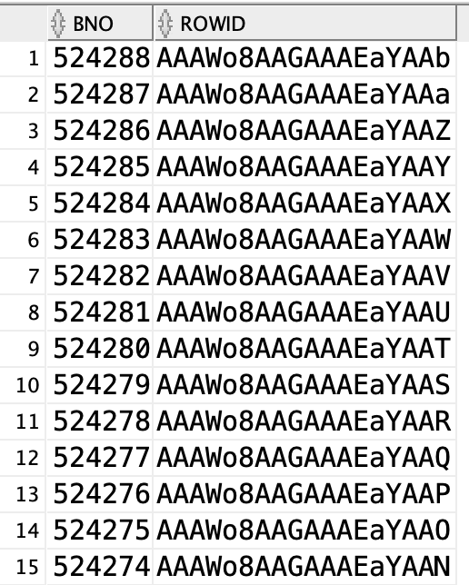

      - 인덱스와 실제 테이블을 연결하는 고리는 ROWID라는 존재
        - DB 내의 주소에 해당하는데 모든 데이터는 자신만의 주소를 갖고 있음
      - SQL을 통해서 bno 값이 100 인 데이터를 찾고자 할때 SQL은 where bno = 100 과 같은 조건을 주게 됨
      - DB 입장에서는 tbl_board 라는 책에서 bno 값이 100인 데이터를 찾아야만 함
      - 만일 책이 얇아서 내용이 많지 않다면 속히 전체를 살펴보는 것이 더 빠를 것
        - 이를 DB에서는 FULL SCAN 이라고 표현
      - 하지만 내용이 많고, 색인이 존재한다면 당연히 색인을 찾고 색인에서 주소를 찾아서 접근하는 방식을 이용할 것
  - #### 인덱스를 이용하는 정렬
    - 인덱스에서 가장 중요한 개념 중 하나는 '정렬이 되어 있다는 점'
      - 데이터를 찾아내서 이들을 SORT 하는 과정을 생략할 수 있다는 것
  - #### SQL 힌트 사용 문법
    - select 문을 작성할 때 힌트는 잘못 작성되어도 실행할 때는 무시되기만 하고 별도의 에러는 발생하지 않음
    - `/*+` 로 시작하고 `*/`로 마무리 됨
    ```sql
      SELECT /*+ Hint name (param...) */ column name, ...
      FROM table name
      ...
    ```
    - 힌트 자체는 SQL로 처리되지 않기 때문에 위의 그림처럼 뒤에 칼럼명이 나오더라도 별도의 ','로 처리되지 않음
  - #### Full 힌트
    - 힌트 중에는 해당 select 문을 실행할 때 테이블 전체를 스캔할 것으로 명시하는 FULL 힌트가 있음
    - FULL 힌트는 테이블의 모든 데이터를 스캔하기 때문에 데이터가 많을때는 상당히 느리게 실행됨
    ```sql
     select /*+ FULL(tbl_board)*/ * from tbl_board order by bno desc;
    ```
    -
  - #### INDEX_ASC, INDEX_DESC 힌트
    - 흔히 목록페이지에서 가장 많이 사용하는 힌트는 인덱스와 관련된 'INDEX_ASC', 'INDEX_DESC' 힌트
    - 'order by' 를 위해서 사용한다고 생각하면 됨
    - 인덱스 자체가 정렬을 해둔 상태이므로 이를 통해서 SORT 과정을 생략하기 위한 용도
    ~~~sql
     select /*+ INDEX_ASC (tbl_board pk_board) */ *
     from tbl_board where bno>0;
    ~~~
    - INDEX_ASC/DESC 를 이용하는 경우에는 동일하 조건의 order by 구문을 작성하지 않아도 됨 예를 들어 위의 SQL에서 아무런 order by 조건이 없어도 bno의 순번을 통해서 접근하기 때문에 'order by bno asc' 구문은 필요로 하지 않음

  - #### ROWNUM과 인라인뷰
    - 필요한 만큼의 데이터를 가져오는 방식에 대해서 학습
    - 오라클 DB는 페이지 처리를 위해서 ROWNUM 이라는 특별한 키워드를 사용해서 데이터에 순번을 붙여 사용함
    - ROWNUM은 쉽게 생각해서 SQL이 실행된 결과에 넘버링을 해준다고 생각하면 됨
    - 모든 select 문에는 ROWNUM이라는 변수를 이용해서 해당 데이터가 몇 번째로 나오는지 알아낼 수 있음
    - ROWNUM은 실제 데이터가 아니라 테이블에서 데이터를 추출한 후에 처리되는 변수
    - 상황에 따라서 그 값이 매번 달라질 수 있음
    ~~~sql
     select rownum rn, bno, title from tbl_board;
    ~~~
    - 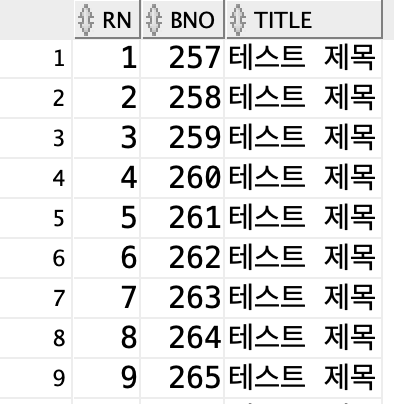
    - 아무 조건이 없기 때문에 데이터는 테이블에 섞여 있는 상태 그대로 나오게 됨
      - 테이블을 FULL 스캔한 것과 동일함
    - ROWNUM은 테이블에는 존재하지 않고, 테이블에서 가져온 데이터를 이용해서 번호를 메기는 방식으로 위의 결과는 ***테이블에서 가장 먼저 가져올 수 있는 데이터들을 꺼내서 번호를 붙여주고 있음***
    - 위의 결과에서 259번 데이터는 3번째로 꺼내진 데이터라고 해석 할 수 있음
    - 만일 데이터를 가져온 후에 정렬을 하게 되면 259번의 ROWNUM 값은 동일하게 3이 됨
    ~~~sql
      select /*+ FULL(tbl_board) */
      rownum rn, bno, title
      from tbl_board where bno > 0
      order by bno;
    ~~~
    - 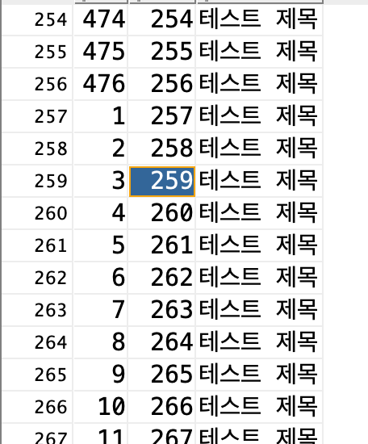
    - 위의 결과는 SQL을 FULL 힌트를 이용해서 *전체 데이터를 조회하고 다시 정렬한 방식*
    - 259번 데이터는 3번째로 접근되었지만 정렬 과정에서 뒤쪽으로 밀리는 것을 볼 수 있음
    - 알 수 있는 사실은 **ROWNUM이란 것은 데이터를 가져올 때 적용되는 것이고**, **이 후에 정렬되는 과정에서는 ROWNUM이 변경되지 않는다는 것**
    - 다른 말로는 *정렬은 나중에 처리된다는 의미이기도 함*
  - #### 인덱스를 이용한 접근 시 ROWNUM
      - ROWNUM의 의미가 테이블에서 데이터를 가져오면서 붙는 번호라는 사실을 기억해 보면 결국 문제는 테이블에 어떤 순서로 접근하는가에 따라서 ROWNUM 값은 바뀔 수 있다는 뜻이 됨
      - FULL로 접근해서 259번 데이터를 찾았고 이후에 정렬을 하느네 이미 데이터는 다 가져온 상테이므로 ROWNUM에는 아무러너 영향을 주지 않음
      - 만일 PK_BOARD 인덱스를 통해서 접근한다면 다음과 같은 과정으로 접근
        1. PK_BOARD 인덱스를 통해서 테이블에 접근
        2. 접근한 데이터에 ROWNUM 부여
      - 1의 과정에서 이미 정렬 되어있기 때문에 259번의 접근 순서는 3번째가 아니라 한참 뒤일 것
      - 이 경우 ROWNUM은 전혀 다른 값을 가지게 됨
        - Result: rn = 259
    ~~~sql
    select /*+ INDEX_DESC(tbl_board pk_board) */
    rownum rn, bno, title
    from tbl_board;
    ~~~
    - bno 259 = rn 123412341234
    - bno 값이 가장 높은 데이터를 가장 먼저 가져오게 됨
    - 이 방식을 이용하면 각 게시물을 정렬하면서 순번을 매겨줄 수 있는데, 1페이지의 경우는 위의 그림에서 RN이라는 칼럼의 값이 1부터 10에 해당한다고 볼 수 있음
  - #### 페이지 번호 1, 2의 데이터
    - 한 페이지당 10개의 데이터를 출력한다고 가정 ROWNUM 조건을 where 구문에 추가해서 작성할 수 있음
    ~~~sql
    select /*+ INDEX_DESC(tbl_board pk_board) */
    rownum rn, bno, title
    from tbl_board where rownum <= 10;
    // 나는 rn > 0 and rn < 10; 이게 안돼서
    // rownum > 0 and rownum > 10; 이렇게..
    ~~~
    - ==ROWNUM 조건은 반드시 1이 포함되어야 함==
    - ##### 2페이지
    ~~~sql
    select /*+ INDEX_DESC(tbl_board pk_board) */
    rownum rn, bno, title
    from tbl_board where rownum > 10 and rownum <= 20 ;
    ~~~
    - 이렇게 하면 될 것 같았지만 실제로는 데이터가 하나도 뜨지 않음
    - 실행계획을 살펴보면 (안쪽에서 바깥쪽이라는게 <- 이 방향을 얘기하는거 였음)
    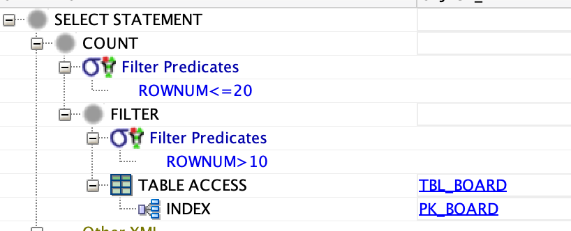
    1. 우선 ROWNUM > 10 의 조건을 만족하는 데이터들을 찾게됨
    2. 문제는 TBL_BOARD에 처음으로 나오는 ROWNUM의 값이 1이라는 것
    3. TBL_BOARD에서 데이터를 찾고 ROWNUM 값이 1이된 데이터는 where 조건에 의해서 무효화 됨
    4. 이후에 다시 다른데이터를 가져오면 가져온 데이터도 첫번째 데이터가 되므로 다시 ROWNUM은 1이됨
    5. 이 과정이 반복되면 ROWNUM 값은 항상 1로 만들어지고 없어지는 과정이 반복되므로 테이블의 모든 데이터를 찾아내지만 결과는 아무것도 나오지 않게 됨
    6. 이러한 이유로 ==ROWNUM 조건은 반드시 1이 포함되어야 함==
    ~~~sql    
    select /*+ INDEX_DESC(tbl_board pk_board) */
    rownum rn, bno, title
    from tbl_board where rownum <= 20 ;
    ~~~
    - 데이터를 20개 씩 가져오는 것은 할 수 있지만 1페이지의 내용이 같이 출력되는 문제가 있으므로 마지막으로 이 문제를 수정해야 함
  - #### 인라인뷰(In-line View) 처리  
    - 이 문제의 해결하기 위해서는 *인라인 뷰* 라는 것을 이용함
    - 쉽게 'SELECT 문 안쪽 FROM 에 다시 SELECT 문'으로 이해 할 수 있음
    - 논리적으로는 어떤 결과를 구하는 SELECT 문이 있고, 그 결과를 다시 대상으로 삼아서 SELECT를 하는 것
    - DB에서는 테이블이나 인덱스와 같이 (View)라는 개념이 존재함
    - 'View'는 일종의 '창문'같은 개념으로 복잡한 SELECT 처리를 하나의 뷰로 생성하고, 사용자들은 뷰를 통해서 복잡하게 만들어진 결과를 마치 하나의 테이블처럼 쉽게 조회한다는 개념
    - 인라인뷰는 이러한 뷰의 작성을 별도로 작성하지 않고 말 그대로 FROM 구문 안에 바로 작성하는 형태
    ~~~sql
    select from (
      select ...
      from ...
    )
    ~~~
    - 외부에서 SELECT 문은 인라인 뷰로 작성된 결과를 마치 하니의 테이블처럼 사용함
    - 20개의 데이터를 가져오는 SQL을 하나의 테이블처럼 간주하고 바깥쪽에서 추가적인 처리를 하는 것
    ~~~ sql
    select
      bno, title, content
    from (
      select /*+ INDEX_DESC(tbl_board pk_board) */
        rownum rn, bno, title, content
      from
        tbl_board
      where rownum <= 20;
    )
    where rn > 10;
    ~~~

    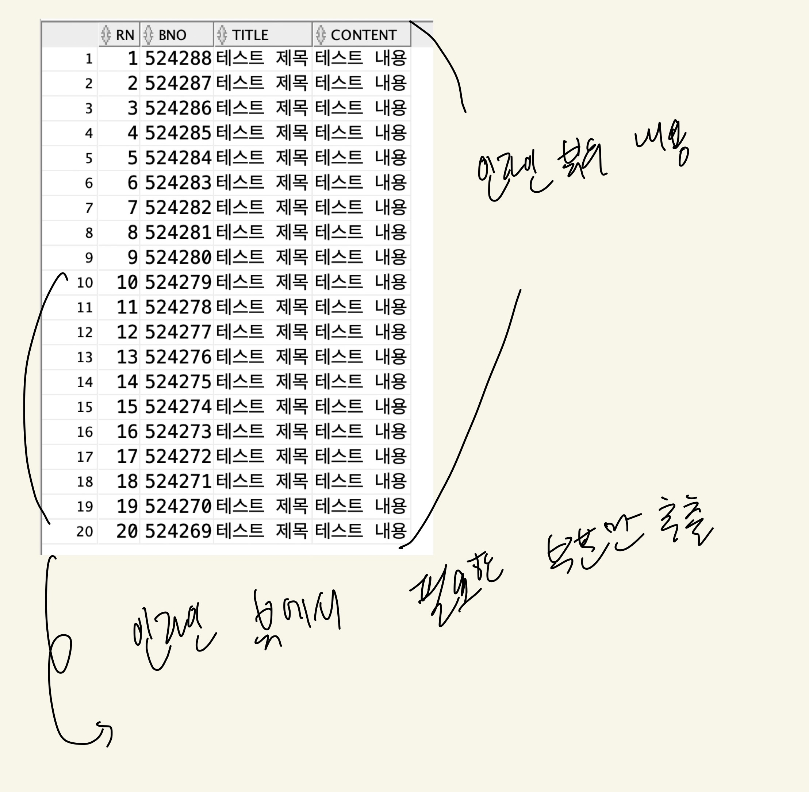
    - 이 과정을 정리하면
      1. 필요한 순서로 정렬된 데이터에 ROWNUM을 붙인다
      2. 처음부터 해당 페이지의 데이터를 'ROWNUM <= 30' 과 같은 조건을 이용해서 구한다
      3. 구해놓은 데이터를 하나의 테이블처럼 간주하고 인라인 뷰로 처리한다.
      4. 인라인 뷰에서 필요한 데이터만을 남긴다.
---

### 2

**MyBatis와 스프링에서 페이징 처리**

  - MyBatis는 SQL을 그대로 사용할 수 있기 때문에 인라인 뷰를 이용하는 SQL을 작성
  - 필요한 파라미터를 지정하는 방식으로 페이징 처리를 하게 됨
  - 신경 써야할 점은 페이징 처리를 위해서는 SQL을 실행할 때 몇 가지 파라미터가 필요함
    1. 페이지 번호(pageNum)
    2. 한 페이지당 몇개의 데이터(amount)를 보여줄 것인지가 결정 되어야함
    - 별도의 파라미터로 전달하는 방식도 나쁘지는 않지만 데이터를 하나의 객체로 묶어서 전달하는 방식이 나중을 생각하면 확장성에 더 좋음
---
**1. Criteria 클래스** (criteria [명사] 규준, 표준, 기준)
  - org.zerock.domain -> Criteria.java
  ~~~java
  package org.zerock.domain;

  import lombok.Getter;
  import lombok.Setter;
  import lombok.ToString;

  @Getter
  @Setter
  @ToString
  public class Criteria {

  	private int pageNum;
  	private int amout;

  	public Criteria() {
  		this(1, 10);
  	}

  	public Criteria(int pageNum, int amount) {
  		this.pageNum = pageNum;
  		this.amout = amount;
  	}
  }
  ~~~
  - Criteria 클래스의 용도는 pageNum과 amount 값을 같이 전달하는 용도지만 기본 생성자를 통해서 기본값을 1페이지, 10개로 지정해서 처리함
  - Lombok을 톤ㅇ해서 getter/setter를 생성해 줌

**1.1 MyBatis 처리와 테스트**
  - BoardMapper 는 인터페이스와 어노테이션을 이용하기 때문에 페이징 처리와 같이 경우에 따라 SQL 구문처리가 필요한 상황에서는 복잡하게 작성됨
    - SQL문이 길어지고 복잡해지면 저자는 XML로 처리하는 것이 더 알아보기 쉽고 관리하기 쉽다고 생각함
  - org.zerock.mapper.BoardMapper 에는 위에서 작성한 Criteria 타입을 파라미터로 사용하는 getListWithPaging() 메서드를 작성
  ~~~java
  public List<BoardVO> getListWithPaging(Criteria cri);
  ~~~
  - src/main/resources/org.zerock.mapper.BoardMapper.xml
  - getListWithPaging 에 해당하는 태그를 추가함
  ~~~xml
  <select id="getListWithPaging">
		<![CDATA[
		    select
		     bno, title, content, writer, regdate, updatedate
		    from (
		      select /*+ INDEX_DESC(tbl_board pk_board) */
		        rownum rn, bno, title, content, writer, regdate, updatedate
		      from
		        tbl_board
		      where rownum <= 20;
		    )
		    where rn > 10;
		]]>
	</select>
  ~~~
  - XML을 사용할 경우에는 `'<', '>'` 는 태그로 인식하는데 이로 인한 문제를 막기위해 CDATA 색션 사용 `(&lt; 나 &gt; 와 같은 특수 문자를 사용할 수 있기도 함)`
  - 인라인 뷰에서는 BoardVO를 구성하는데 필요한 모든 칼럼과 ROWNUM을 RN이라는 가명을 이용해서 만들어 주고 바깥쪽 SQL 에서는 RN 컬럼을 조건으로 처리함

**1.1 1 페이징 테스트와 수정**
  - MyBatis의 `#{}`을 적용하기 전에 XML 설정이 제대로 동작하는지 테스트
  - src/test/java -> BoardMapperTests
  - Criteria 클래스에 생성된 객체는 pageNum은 1, amount는 10이라는 기본값을 가지므로 별도의 파라미터 없이 생성함
  ```java
  @Test
   public void testPaging() {
     Criteria cri = new Criteria();
     List<BoardVO> list = mapper.getListWithPaging(cri);
     list.forEach(board -> log.info(board));
   }
  ```
  - 현재는 파라미터의 값이 반영되지 않으므로 2페이지의 내용이 정상적으로 나오는지 확인
  - Criteria 객체 내부의 값을 이용해서 SQL이 동작하도록 수정
  - 20과 10이라는 값은 결국 pageNum과 amount를 이용해서 조절되는 값임
  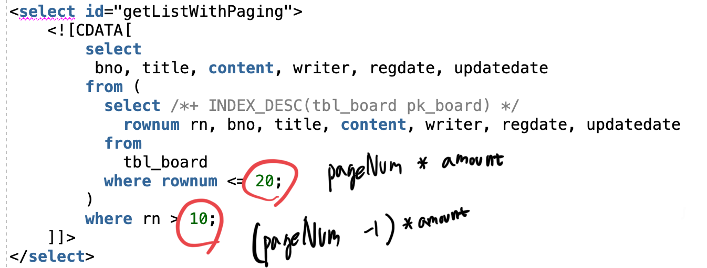
  - BoardMapper.xml을 수정해서 페이지 번호(pageNum)와 데이터 수(amount)를 변경 할 수 있게 수정
  ~~~xml
  <select id="getListWithPaging" resultType="org.zerock.domain.BoardVO">
    <![CDATA[
        select
         bno, title, content, writer, regdate, updatedate
        from (
          select /*+ INDEX_DESC(tbl_board pk_board) */
            rownum rn, bno, title, content, writer, regdate, updatedate
          from
            tbl_board
          where rownum <= #{pageNum} * #{amount}
        )
        where rn > (#{pageNum} - 1) * #{amount}
    ]]>
  </select>
  ~~~
 - testPaging() 내용 수정
 ```java
 @Test
 	public void testPaging() {
 		Criteria cri = new Criteria();
 		cri.setPageNum(3);
 		cri.setAmount(10);
 		List<BoardVO> list = mapper.getListWithPaging(cri);
 		list.forEach(board -> log.info(board));
 	}
 ```
 - Criteria 객체를 생성할 때 파라미터를 추가해보거나, setter를 이용해서 내용을 수정

**1.2 BoardController와 BoardService 수정**

  - 페이징 처리는 브라우저에서 들어오는 정보들을 기준으로 동작하기 때문에 Board Controller와 BoardService 역시 전달되는 파라미터들을 받는 형태로 수정해야 함

**1.2.1 BoardService**
 - BoardSerivce는 Criteria를 파라미터로 처리하도록 BoardService 인터페이스와 BoardServiceImpl 클래스를 수정
 - BoardService.java
    ```java
    //	public List<BoardVO> getList();
    public List<BoardVO> getList(Criteria cri);
    ```
  - BoardSerivceImpl.java
    ```java
    //	@Override
    //	public List<BoardVO> getList() {
    //		// TODO Auto-generated method stub
    //		log.info("getList");
    //		return mapper.getList();
    //	}

    	@Override
    	public List<BoardVO> getList(Criteria cri) {
    		// TODO Auto-generated method stub
    		log.info("get List with criteria: " + cri);
    		return mapper.getListWithPaging(cri);
    	}
    ```

**1.2.2 BoardController 수정**
  - 기존 BoardController의 list()는 아무런 파라미터가 없이 처리되었기 때문에 pageNum과 amount를 처리하기 위해서 아래와 같이 수정
  - Criteria 클래스를 하나 만들어 두면 위와 같이 편하게 하나의 타입만으로 파라미터나 리턴 타입을 사용할 수 있기 때문에 여러모로 편함
  ```java
  //	@GetMapping("/list")
  //	public void list (Model model, Criteria cri) {
  //		log.info("list");
  //		model.addAttribute("list", service.getList(cri));
  //	}

  @GetMapping("/list")
  public void list (Model model, Criteria cri) {
    log.info("list: " + cri);
    model.addAttribute("list", service.getList(cri));
  }
  ```
  **BoardControllerTests**
   - BoardController 역시 이전에 테스트를 진행했으므로, pageNum과 amount를 파라미터로 테스트 해봄
  ```java
  @Test
  public void testPaging() throws Exception{
    log.info(mockMvc.perform(
      MockMvcRequestBuilders.get("/board/list")
        .param("pageNum", "2")
        .param("amount", "10"))
        .andReturn().getModelAndView().getModelMap());

  }
  ```
