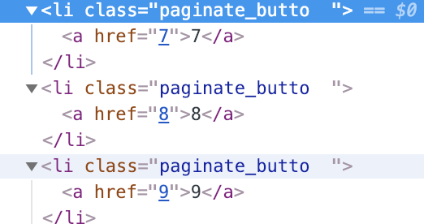

### 1. 페이징 화면처리
  - 작업 과정
    1. 브라우저 주소창에서 페이지 번호를 전달해서 결과를 확인하는 단계
    2. JSP에서 페이지 번호를 출력하는 단게
    3. 각 페이지 번호에 클릭 이벤트 처리
    4. 전체 데이터 개수를 반영해서 페이지 번호 조절
  - 페이지 번호가 어떤 작업을 하던 유지되면서 링크가 연결되는 작업을 해야함
---
  - **1.1 페이징 처리할 때 필요한 정보들**
    1. 현재 페이지 번호
    2. 이전과 다음으로 이동 가능한 링크의 표시 여부(prev, next)
    3. 화면에서 보여지는 페이지의 시작 번호와 끝 번호(startPage, endPage)  
    - **1.1.1 끝 페이지 번호와 시작 페이지 번호**
      - 흔히 시작 페이지의 번호를 먼저 하려고 하지만, 오히려 끝 번호를 먼저 계산하는 것이 수월함
      ~~~java
      //Math.ceil은 소수점을 올림으로 처리
      this.endPage = (int)(Math.ceil(페이지번호 / 10.0) * 10;
      ~~~
      1p : Math.ceil(0.1) * 10 = 10
      2p : Mathi.ceil(0.2) * 10 = 10 (0.2 = 1)
      10p : Math.ceil(1) * 10 = 10
      11p : Math.ceil(1.1) * 10 = 20 (1.1 = 2)
      38p : Math.ceil(3.8) * 10 = 40 (3.8 = 4)

      `18이든 37이든 27이든 13이든 나는 10 페이지만 볼거니까 뒷자리가 0 보다만 크면 무조건 올림해주면 되는구나`
      - **시작 번호**
        - 만일 10개씩 보여준다고 하면 시작은 무조건 끝에서 9를 뺀 값이 됨
        ```java
        this.startPage = this.endPage - 9;
        ```
      - **끝 번호**
        - 끝 번호(endPage)는 전체 데이터 수(total)에 의해서 영향을 받음
        - 예를 들어 10개씩 보여주는 경우 전체 데이터(total)가 80개라고 가정하면 끝 번호(endPage)는 10이 아닌 8이 되어야 함
        - 만일 끝 번호(endPage)와 한 페이지당 출력되는 데이터(amount)의 곱이 전체 데이터(total)보다 크다면 끝 번호(endPage)는 다시 total을 이용해서 계산 되어야 함
        ```java
        int realEnd = (int)(Math.ceil(total * 1.0) /amount));
        if(realEnd < this.endPage){
          this.endPage = realEnd;
        }
        ```
        1. 전체 데이터(total)을 이용해서 진짜 끝 페이지(realEnd)가 몇번까지 되는지를 계산
        2. 만일 끝페이지(realEnd)가 구해둔 끝 번호(endPage) 보다 작다면 끝 번호(endPage)는 진짜 끝 페이지(reaEnd)와 같게 함
      - **이전(prev)와 다음(next)**
        - 이전의 경우는 시작 번호(startPage)가 1보다 큰 경우라면 존재하게
        ```java
        this.prev = this.startPage > 1;
        ```
        - 다음으로 가는 링크는 realEnd가 끝 번호(endPage)보다 큰 경우에만 존재하게 됨
        ```java
        this.next = this.endPage > realEnd;
        ```        
  - **1.2 페이징 처리를 위한 클래스 설계**
    - org.zerock.domain -> PageDTO
    - PageDTO는 생성자를 정의하고 Criteria와 전체 데이터 수(total)를 파라미터로 지정함
    - Criteria 안에는 페이지에서 보여주려는 데이터 수(amount)와 현재 페이지 번호(pageNum)를 가지고 있기 때문에 이를 이용해서 필요한 모든 내용을 계산할 수 있음
    ```java
    package org.zerock.domain;

    import lombok.Getter;
    import lombok.ToString;

    @Getter
    @ToString
    public class PageDTO {

    	private int startPage;
    	private int endPage;
    	private boolean prev, next;

    	private int total;
    	private Criteria cri;

    	public PageDTO(Criteria cri, int total) {

    		this.cri = cri;
    		this.total = total;

    		this.endPage = (int)(Math.ceil(cri.getPageNum() / 10.0)) * 10;
    		this.startPage = this.endPage - 9;

    		int realEnd = (int)(Math.ceil((this.total * 1.0) / cri.getAmount()));

    		if (realEnd < this.endPage) {
    			this.endPage = realEnd;
    		}

    		this.prev = this.startPage > 1;
    		this.next = this.endPage < realEnd;
    	}
    }    
    ```
    - BoardController에서는 PageDTO를 사용할 수 있도록 Model에 담아서 화면에 전달해 줄 필요가 있음
    - list()는 'pageMaker'라는 이름으로 PageDTO 클래스에서 객체를 만들어서 Model에 담아줌
    - PageDTO()를 구성하기 위해서는 전체 데이터 수가 필요한데, 아직 그 처리가 이루어지지 않았으므로 임의의 값으로 123을 지정
    ```java
    @GetMapping("/list")
    public void list (Model model, Criteria cri) {
      log.info("list: " + cri);
      model.addAttribute("list", service.getList(cri));
      model.addAttribute("pageMaker", new PageDTO(cri, 123));
    }
    ```
  - **3. JSP에서 페이지 번호 출력**
    - JSP에서 페이지 번호를 출력하는 부분은 JSTL을 이용
    - [부트스트랩 예제](http://v4-alpha.getbootstrap.com/components/pagination)
    ```html
    <div class='pull-right'>
      <ul class="pagination">
        <c:if test="${pageMaker.prev}">
          <li class="paginate_button previous"><a href="#">Previous</a></li>
        </c:if>
        <c:forEach var="num" begin="${pageMaker.startPage}" end="${pageMaker.endPage}">
          <li class="paginate_button"><a href="#">${num}</a></li>
        </c:forEach>
        <c:if test="${pageMaker.next}">
          <li class="paginate_button next"><a href="#">Next</a></li>
        </c:if>
      </ul>
    </div>
    <!-- end Pagination -->   
    ```
    - 현재 total은 123 이므로 5 페이지를 조회하면 next = true ( 123.0 / 10 = 13)  realEnd > endPage
    - 반면 amount 값이 20인 경우에는 7 페이지까지만 떠야함 (123.0 / 20  = 7) realEnd < endPage
    - **3.1 페이지 번호 이벤트 처리**
      - 여기까지 진행하면 페이지 번호 클릭시 이벤트 처리가 되어 있지 않음
      - 일반적으로 `<a>` 태그의 href 속성을 이용하는 방법을 사용할 수도 있지만, 검색 조건이 붙고 난 후에 처리가 복잡하게 되므로 JavaScript를 통해서 처리하는 방식을 이용
      - 우선 페이지와 관련된 `<a>`태그의 href 속성값으로 페이지 번호를 가지도록 수정함
        - 번호의 출력은 `<c:out>`을 이용해서 출력하는것이 좋지만 예제에서는 가독성의 문제로 일반 EL을 사용함
      ```html
      <div class='pull-right'>
        <ul class="pagination">
          <c:if test="${pageMaker.prev}">
            <li class="paginate_button previous"><a href="${pageMaker.startPage -1}">Previous</a>
            </li>
          </c:if>
        <c:forEach var="num" begin="${pageMaker.startPage}" end="${pageMaker.endPage}">
          <li class="paginate_button ${pageMaker.cri.pageNum == num ? "active":""} "><a href="${num}">${num}</a></li>
        </c:forEach>
        <c:if test="${pageMaker.next}">
            <li class="paginate_button next"><a href="${pageMaker.endPage + 1}">Next</a>
            </li>
          </c:if>
      </ul>
      </div>
      ```
      ;
      - a 태그는 단순히 번호만을 가지게 됨 페이지 번호를 클릭하면 해당하는 URL이 존재하지 않기 때문에 문제가 됨
      - `<a>` 태그가 원래의 동작을 못하도록 JavaScript 처리를 함
      - 실제 페이지를 클릭하면 동작을 하는 부분은 별도의 <form> 태그를 이용해서 처리하도록 함
      - `<c:out>`을 사용하는 것이 더 좋은 방법이지만 간단히 사용하기 위해서 EL로 처리함
      ```html
      <!-- list.jsp 에 추가 -->
      <form id='actionForm' action="/board/list" method='get'>
  	 		<input type='hidden' name='pageNum' value = '${pageMaker.cri.pageNum}'>
  	 		<input type='hidden' name='amount' value = '${pageMaker.cri.amount}'>
  		</form>      
      ```
      - 기존의 코드에 페이지 번호를 클릭하면 처리하는 부분을 추가
      1. `<a>` 태그를 클릭해도 페이지 이동이 없도록 preventDefault() 처리를 함
      2. `<form>` 태그 내 pageNum 값을 paginate_button의 `<a>` 태그에  href 속성 값으로 변경
      3. 페이지 번호를 클릭 했을때 `<form>` 태그 내의 페이지 번호가 바뀌는 것을 확인할 수 있음
      ```javascript
      var actionForm = $("#actionForm");
      $(".paginate_button a").on("click", function(e){
        e.preventDefault();
        console.log('click');
        actionForm.find("input[name='pageNum']")
        .val($(this).attr("href"));
        // actionForm.submit();
      });
      ```
      - **조회 페이지로 이동**
        - 사용자가 3페이지에 있는 개시글을 조회하고 List 로 돌아오면 pageNum이 1 무조건 첫 페이지로 돌아옴 ( 뒤로가기에선 정상적으로 조회하기 전 페이지로 가짐 )
        - 이를 해결하기 위해서는 조회 페이지로 갈 때 현재 목록 페이지의 pageNum과 amount를 같이 전달해야 함
        - 이런 경우 페이지 이동에 사용했던 `<form>` 태그에 추가로 게시물 번호를 같이 전송하고, action 값을 조정해서 처리 할 수 있음
        - 원래 게시물의 제목에는 `/board/get?bno=xxx`로 이동할 수 있는 링크가 직접 처리되어 있었음
        ```html
        <td><a href='/board/get?bno=<c:out value="${board.bno}"/>'><c:out value="${board.title}"/></a></td>
        ```
        - 페이지 번호는 조회 페이지에 전달 되지 않기 때문에 조회 페이지에서 목록 페이지로 이동할때는 아무런 정보가 없이 다시 `/board/list`를 호출하게 됨
        - 간단하게는 각 게시물의 링크에 추가로 `&pageNum=xx`와 같이 처리할 수도 있지만 나중에 여러 조건이 추가되는 상황에서는 복잡한 링크를 생성해야만 함
        -`<a>` 태그로 복잡한 링크를 생성하는 방식이 나쁘다고는 말할 수 없음
        - 가장 대표적인 예가 검색엔진
          - 이 같은 경우에는 출력된 정보와 링크를 저장해서 사용하기 때문에 `<a>` 태그 내의 링크가 완전한 URL일 경우에 노출에 유리함
          - 만일 웹페이지가 검색엔진에 의해서 노출이 필요한 경우라면 직접 모든 문자열을 구성해 주는 방식이 더 좋음
          - 직접 링크로 연결된 경로를 페이지 이동과 마찬가지로 `<form>` 태그를 이용해서 처리할 것이므로 `<a>` 태그에는 이동하려는 게시물의 번호만을 가지게 수정함 (이벤트 처리를 수월하게 하기 위해서 `<a>` 태그에 class 속성을 하나 부여함)
          ```html
          <td><a class='move' href='<c:out value="${board.bno}"/>'><c:out value="${board.title}"/></a></td>
          ```
          - 마우스를 올려보면 `localhost:8080/board/123124` 이런식으로 출력됨
          - 실제 클릭은 JavaScript를 통해서 게시물의 제목을 클릭했을 때 이동하도록 이벤트 처리를 새로 작성함
          1. `<form>` 태그에 추가로 bno 값을 전송하기 위해서 `<input>` 태그를 만들어 줌
          2. `<form>` 태그의 action 은 `/board/get`으로 변경
          3. 위의 파라미터 처리가 정상적으로 되었다면 게시물의 제목을 클릭했을 때 pageNum과 amount가 전달되는 것을 볼 수 있음
          ```javascript
          $(".move").on("click", function(e){
            e.preventDefault();
            actionForm.append("<input type= 'hidden' name='bno' value='"+$(this).attr("href")+"'>");
            actionForm.attr("action", "/board/get");
            actionForm.submit();
          });
          ```
        - **조회 페이지에서 다시 목록 페이지로(페이지 번호 유지)**
          - 목록에서 조회로가는 파라미터들이 전송 되었다면 조회 페이지에서 목록으로 이동하기 위한 이벤트를 처리해야 함
          - BoardController의 get() 메서드는 원래 게시물의 번호만 받도록 처리되어 있지만 추가적인 파라미터 Criteria를 받고 전달
          - `@ModelAttrbute`는 자동으로 Model에 데이터를 지정한 이름으로 담아줌
          - 이 어노테이션을 사용하지 않아도 Controller에서 화면으로 파라미터가 된 객체는 전달이 되지만, 좀 더 명시적으로 이름을 지정하기 위해서 사용함
          ```java
          @GetMapping({"/get", "/modify"})
          public void get(@RequestParam("bno") Long bno, Model model, @ModelAttribute("cri") Criteria cri) {
            log.info("/get or modify");
            model.addAttribute("board", service.get(bno));
          }
          ```
          - 기존 get.jsp에서는 버튼을 클릭하면 `<form>` 태그를 이용하는 방식이었으므로 필요한 데이터를 추가해서 이동하도록 수정
          ```javascript
          <form id='operForm' action="/board/bodify" method="get">
        		<input type='hidden' id='bno' name='bno' value='<c:out value="${board.bno}"/>'>
        		<input type='hidden' id='pageNum' name='pageNum' value='<c:out value="${cri.pageNum}"/>'>
        		<input type='hidden' id='amount' name='amount' value='<c:out value="${cri.amount}"/>'>
        	</form>          
          ```
          - get.jsp는 openForm이라는 id를 가진 `<form>` 태그를 이미 이용했기 때문에 cri 라는 이름으로 전달된 Criteri 객체를 이용해서 pageNume과 amount값을 태그로 구성하고 이동하게 할 수 있음
        - **조회 페이지에서 수정/삭제 페이지로 이동**
          - 조회 페이지에서는 Modify 버튼을 통해서 수정/삭제 페이지로 이동하게 됨
          - 수정/삭제 페이지는 다시 목록으로 가는 버튼이 존재하므로 동일하게 목록 페이지에 필요 파라미터를 넘겨주어야 함
          - BoardController 에서는 get() 메서드에서 '/get'과 '/modify'를 같이 처리하므로 별도의 추가적인 처리 없이도 Criteria를 Model에 cri라는 이름으로 담아서 전달
        - **5. 수정과 삭제 처리**
          - modify.jsp 에서는 `<form>` 태그를 이용해서 데이터를 처리
          - 입력과 거의 비슷한 방식으로 구현되는데, 이제 pageNum과 amount 라는 값이 존재하므로 `<form>` 태그내에서 같이 전송할 수 있게 수정해야함
          ```javascript
          <input type='hidden' name='pageNum' value='<c:out value="${cri.pageNum }"/>'>
          <input type='hidden' name='amount' value='<c:out value="${cri.amount }"/>'>
          ```
        - **5.1 수정/삭제 처리후 이동**
          - Post 방식으로 진행하는 수정과 삭제 처리는 BoardController에서 각각의 메서드 형태로 구현되어 있으므로 페이지 관련 파라미터들을 처리하기 위해서는 변경해 줄 필요가 있음
          - 메서드의 파라미터에는 Criteria 가 추가된 형태로 변경되고 RedirectAttributes 역시 URL 뒤에 원래의 페이지로 이동하기 위해서 pageNum과 amount 값을 가지고 이동하게 수정함
          - 수정과 달리 삭제는 처리 후 1페이지로 이동해도 무방하지만, 이왕이면 사용자들에게 자신이 보던 정보를 이어서 볼 수 있게 조치해 주는 방식 역시 어렵지 않음
          ```java
          @PostMapping("/modify")
          public String modify(BoardVO board, @ModelAttribute("cri") Criteria cri, RedirectAttributes rttr) {
        		log.info("modify: " + board);
        		if(service.modify(board)) {
        			rttr.addFlashAttribute("result", "success");
        		}

        		rttr.addAttribute("pageNum", cri.getPageNum());
        		rttr.addAttribute("amount", cri.getAmount());

        		return "redirect:/board/list";
        	}   

          @PostMapping("/remove")
          public String remove(@RequestParam("bno") Long bno,  @ModelAttribute("cri") Criteria cri, RedirectAttributes rttr,) {
            log.info("remove bno: " + bno);
            if(service.remove(bno)) {
              rttr.addFlashAttribute("result", "success");
            }
            rttr.addAttribute("pageNum", cri.getPageNum());
            rttr.addAttribute("amount", cri.getAmount());

            return "redirect:/board/list";
          }
      - **5.2 수정/삭제 페이지에서 목록 페이지로 이동**
        - 페이지 이동의 마지막은 수정/삭제를 취소하고 다시 목록 페이지로 이동하는 것
        - 목록 페이지는 오직 pageNum과 amount만을 사용하므로 `<form>` 태그의 다른 내용들은 삭제하고 필요한 내용만을 다시 추가하는 형태가 편리함
        ```javascript
        if(operation === 'remove'){
          formObj.attr("action", "/board/remove");
        }else if(operation === 'list'){
          //move to list
          formObj.attr("action", "/board/list").attr("method","get");
          var pageNumTag = $("input[name='pageNum']").clone();
          var amountTag = $("input[name='amount']").clone();
          formObj.empty();  
          formObj.append(pageNumTag);
          formObj.append(amountTag);
        }
        formObj.submit();       
        ```
        - `<form>` 태그의 모든것을 지우고 필요한 태그들만 추가해서 '/board/list'를 호출하는 형태를 이용
    - **6. MyBatis에서 전체 데이터의 개수 처리**
      - 최종적으로 데이터베이스에 있는 실제 모든 게시물의 수(total)를 구해서 PageDTO를 구성할 때 전달해 주어야함
      - 전체의 개수를 구하는 SQL은 어렵거나 복잡하지 않기 때문에 어노테이션으로 처리해도 무방하지만 BoardMapper 인터페이스에 getTotalCount() 메서드를 정의하고 XML을 이용해서 SQL을 처리함
      - BoardService와 BoardServiceImpl 에서는 별도의 메서드를 작성해서 BoardMapper의 getTotalCount()를 호출함
      - getTotalCount()는 Criteria를 파라미터로 전달받도록 설계하지 않아도 문제가 생기지는 않지만 게시물의 목록과 전체 데이터수를 구하는 작업은 일관성있게 Creteria를 받는 것이 좋음(검색에서 필요함)
      - BoardService의 getTotal()에 굳이 Criteria는 파라미터로 전달될 필요가 없기는 하지만, 목록과 전체 데이타 개수는 항상 같이 동작하는 경우가 많기 때문에 파라미터로 지정함
      - BoardController 에서는 BoardService의 인터페이스를 통해서 getTotal()을 호출하도록 변경
      ```java
      //BoardMapper.java
      public int getTotalCount(Criteria cri);
      //BoardService(Interface).java
      public int getTotal(Criteria cri);
      // BoardSeviceImpl.java
      @Override
      public int getTotal(Criteria cri) {
      log.info("get total count");
      return mapper.getTotalCount(cri);
      }
      // BoardController.java
      @GetMapping("/list")
      public void list (Model model, Criteria cri) {
        log.info("list: " + cri);
        model.addAttribute("list", service.getList(cri));
        int total = service.getTotal(cri);
        log.info("total Count: " + total);
        model.addAttribute("pageMaker", new PageDTO(cri, total));
      //		model.addAttribute("pageMaker", new PageDTO(cri, 123));
      }
      ```
      - BoardMapper.xml
      ```xml
      <select id="getTotalCount" resultType="int">
        select count(*) from tbl_board where bno>0
      </select>
      ```
